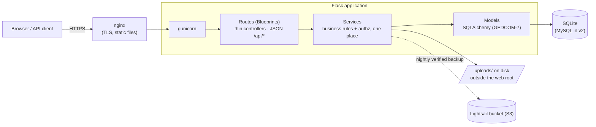

# FamilyHub v1 ("Full")

[](https://github.com/pseudokoder/FamilyHub/actions/workflows/ci.yml)
-brightgreen)


A private family portal built around a **GEDCOM 7–compliant genealogy database**
with a FamilySearch-style site on top — every "feature" (family tree, person
page, timeline, photo album, memory blog) is just a different **view of one
shared database**. Built with Python/Flask as both a real production app for a
real family and a learning project for a future Java/Spring Boot rewrite (v2).

> **Status — under active, deliberate rebuild.** **WP1** (the GEDCOM-7 database
> foundation) and **WP2** (the backend CRUD JSON API + role-based access control)
> are complete. The genealogy **front-end is WP3** — it's built separately against
> the published API contract, so today the genealogy features are exercised
> through the JSON API, not yet through web pages.

**Start here:** [`docs/MASTER_PLAN.md`](docs/MASTER_PLAN.md) is the authoritative
spec (architecture, schema, roadmap); [`DEVDIARY.md`](DEVDIARY.md) is the guided,
textbook-style tour of how it was built. Contributors: [CONTRIBUTING.md](CONTRIBUTING.md).

## What's built today

- **GEDCOM-7 schema** — individuals, names, families & parent/child links,
  events & attributes (with fuzzy *and* sortable dates), reusable places,
  sources/citations/repositories (the evidence layer), media objects, and
  Markdown notes. One database; every view is a query against it.
- **JSON REST API** (`/api/*`) — full CRUD for every resource above, plus their
  sub-records and **polymorphic attachments** (a photo or memory linked to a
  person, family, or event). The contract is in [`docs/openapi.yaml`](docs/openapi.yaml),
  kept in sync by a test that fails if any route is undocumented.
- **Search** — people by name (partial match) with filters (sex, living, birth
  year range, place) and full-text over notes/memories.
- **Access control (RBAC)** — email login and a four-rung role ladder
  (GUEST · USER · POWER\_USER · ADMIN) routed through a single authorization
  layer; reads need a logged-in member, writes need at least USER.
- **Media** — image uploads with **EXIF/GPS stripping** for privacy (a photo
  should show the family, not map their house), stored outside the web root and
  served only behind the login.
- **Admin panel** — invite-only accounts (no public signup), editable site text,
  one-click **verified backups** (off-site to S3), and an audit trail.
- **Security** — bcrypt, CSRF everywhere (including the JSON API), strict CSP
  (no `unsafe-inline`), login rate limiting, security headers, stateless
  single-use password-reset emails.
- **Ops** — health endpoint, one-command Docker run, GitHub Actions CI with a
  90% coverage floor, installable PWA with offline fallback, and a portable JSON
  data export (the v2 zero-data-loss guarantee).

## Roadmap

WP1 Database Foundation ✅ → **WP2 Backend CRUD + API contract ✅** →
WP3 Front-end (built against the API contract) → WP4 Views & Search UI →
WP5 Deploy (AWS Lightsail) → WP6 GEDCOM import/export (tentative). See
[`docs/MASTER_PLAN.md`](docs/MASTER_PLAN.md) §6.

## Architecture



The three layers map 1:1 onto v2's Spring Boot stack: Blueprints →
`@RestController`, services → `@Service`, models → `@Entity` + repositories.

## Quick start (development)

```powershell
# 1. Create/activate the project virtual environment (Windows)
python -m venv .venv
.venv\Scripts\activate

# 2. Install dependencies (dev includes pytest)
pip install -r requirements-dev.txt

# 3. Copy .env.example to .env and set a real SECRET_KEY
copy .env.example .env

# 4. Create the database (runs all migrations)
flask db upgrade

# 5. (optional) Fill a fresh dev DB with three generations of mock data
flask seed

# 6. Create your first admin account (email login)
flask create-admin you@example.com

# 7. Run the dev server, then explore the API at /api/* (or the spec at /apidocs)
flask run
```

### Or run it with Docker

```bash
cp .env.example .env   # set a real SECRET_KEY
docker compose up --build
docker compose exec web flask create-admin you@example.com   # first run only
```

The database, uploads, and backups live in bind-mounted folders (`instance/`,
`uploads/`, `backups/`), so they survive container rebuilds.

## Management commands

```powershell
flask db upgrade               # create/upgrade the database (runs migrations)
flask seed                     # dev only: load demo users + 3 generations of data
flask create-admin <email>     # bootstrap the first admin account
flask backup                   # full backup zip: DB + files, verified, S3 if configured
flask restore-backup <zip>     # DESTRUCTIVE: restore DB + files from a backup
flask export-data              # portable JSON export of everything (v2 migration)
```

## Stack

Python 3.14 · Flask · SQLAlchemy · Flask-Migrate · SQLite (dev; MySQL in v2) ·
Bootstrap 5

## Project layout

```
app/
  __init__.py     # application factory (create_app)
  config.py       # configuration, loaded from .env
  cli.py          # custom flask commands (db, seed, create-admin, backup…)
  models/         # SQLAlchemy GEDCOM-7 models   (≈ Spring Boot @Entity/Repository)
  services/       # business logic + authz       (≈ Spring Boot @Service)
  routes/
    api/          # the JSON REST API blueprint   (≈ Spring Boot @RestController)
    ...           # preserved web routes: auth, admin, main/plumbing
  forms/          # WTForms (auth + admin only; the genealogy UI is WP3)
  templates/      # Jinja2 templates (auth/admin/errors — genealogy UI is WP3)
  static/         # CSS/JS served by Flask
docs/
  MASTER_PLAN.md  # the authoritative spec
  openapi.yaml    # the API contract (kept in sync by a test)
migrations/       # Alembic database migration scripts
seed.py           # development mock data (the Hartwell family)
instance/         # SQLite DB lives here (git-ignored)
uploads/          # uploaded images (git-ignored, outside web root)
```
