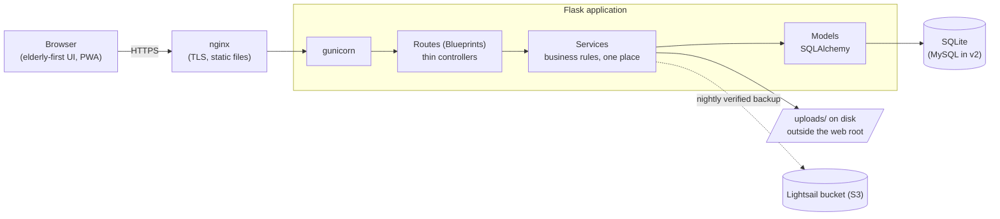

# FamilyHub v1 (Lite)

[](https://github.com/pseudokoder/FamilyHub/actions/workflows/ci.yml)
-brightgreen)


A private family portal: photo albums, family-history blog, member wiki, and
timeline — built with Python/Flask as both a real production app and a
learning project for a future Java/Spring Boot rewrite (v2).

**Start here:** read [DEVDIARY.md](DEVDIARY.md) — it's the guided tour of the
whole codebase, written like textbook chapters. Contributors: see
[CONTRIBUTING.md](CONTRIBUTING.md).

## Features

- **Photo albums** — batch upload (iPhone HEIC converted at the door,
  EXIF/GPS stripped for privacy), drag-to-rearrange, captions, comments,
  tagging people into photos
- **Family blog** ("Memories") and a **wiki** page per family member with
  `[[Name]]` cross-links, full **revision history with one-click restore**,
  and a "Photos featuring X" gallery
- **Timeline** with honest partial dates (1890 / March 1962 / June 12, 1947)
- **Search** across everything; a **What's New** activity feed
- **Admin**: invite-only accounts, content **locking** ("Trial Period" rule),
  audit trail, site settings, one-click verified **backups** (off-site to S3)
- **Security**: bcrypt, CSRF everywhere, strict CSP (no `unsafe-inline`),
  login rate limiting, security headers, login-walled photo serving,
  stateless single-use password-reset emails
- **Ops**: health endpoint, Docker one-command run, GitHub Actions CI with
  a 90% coverage floor, OpenAPI 3.0 spec that tests keep in sync,
  installable PWA with offline fallback, portable JSON export (the v2
  zero-data-loss guarantee)

## Architecture



The three layers map 1:1 onto v2's Spring Boot stack: Blueprints →
`@RestController`, services → `@Service`, models → `@Entity` + repositories.

## Quick start (development)

```powershell
# 1. Activate the virtual environment (Windows)
.venv\Scripts\activate

# 2. Install dependencies
pip install -r requirements.txt

# 3. Copy .env.example to .env and set a real SECRET_KEY
copy .env.example .env

# 4. Create/upgrade the database (runs all migrations)
flask init-db

# 5. Create your first admin account
flask create-admin yourusername

# 6. Run the dev server
flask run
```

Then open http://127.0.0.1:5000 and log in.

### Or run it with Docker (any machine with Docker installed)

```bash
cp .env.example .env   # set a real SECRET_KEY
docker compose up --build
# first run only — create your admin account inside the container:
docker compose exec web flask create-admin yourusername
```

Then open http://127.0.0.1:8000. The database, photos, and backups live
in bind-mounted folders (`instance/`, `uploads/`, `backups/`), so they
survive container rebuilds.

## Management commands

```powershell
flask init-db                  # create/upgrade the database (runs migrations)
flask create-admin <username>  # bootstrap the first admin account
flask backup                   # full backup zip: DB + photos, verified,
                               # uploaded off-site if BACKUP_S3_BUCKET is set
flask restore-backup <zip>     # DESTRUCTIVE: restore DB + photos from a backup
flask export-data              # portable JSON export of everything (v2 migration)
```

## Stack

Python 3 · Flask · SQLAlchemy · Flask-Migrate · SQLite (dev) · Bootstrap 5

## Project layout

```
run.py            # entry point — creates the app via the factory
app/
  __init__.py     # application factory (create_app)
  config.py       # configuration, loaded from .env
  cli.py          # custom flask commands (init-db, create-admin)
  models/         # SQLAlchemy models        (≈ Spring Boot @Entity/Repository)
  services/       # business logic           (≈ Spring Boot @Service)
  routes/         # blueprints / view funcs  (≈ Spring Boot @Controller)
  forms/          # WTForms form classes + validation
  templates/      # Jinja2 HTML templates
  static/         # CSS/JS served by Flask
migrations/       # Alembic database migration scripts
instance/         # SQLite DB lives here (git-ignored)
uploads/          # uploaded photos (git-ignored, outside web root)
```
